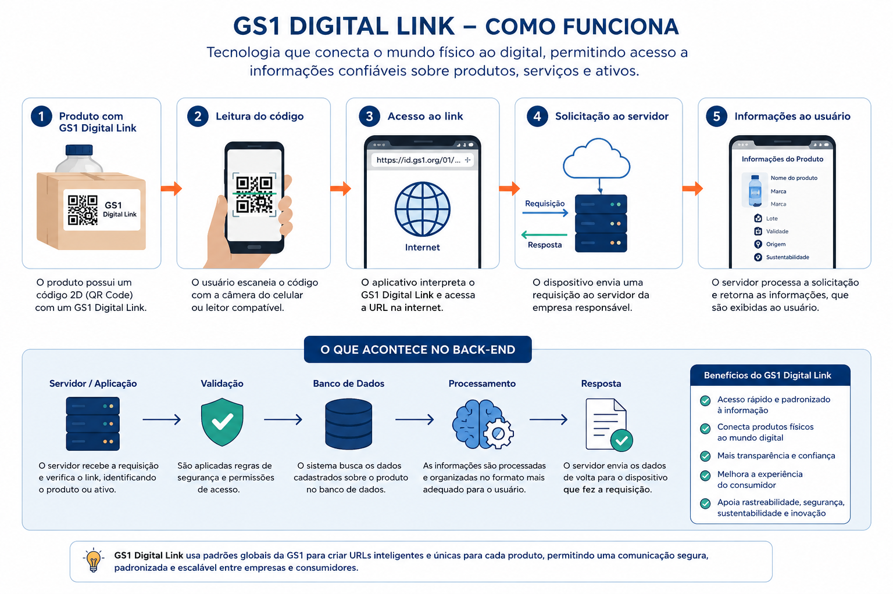
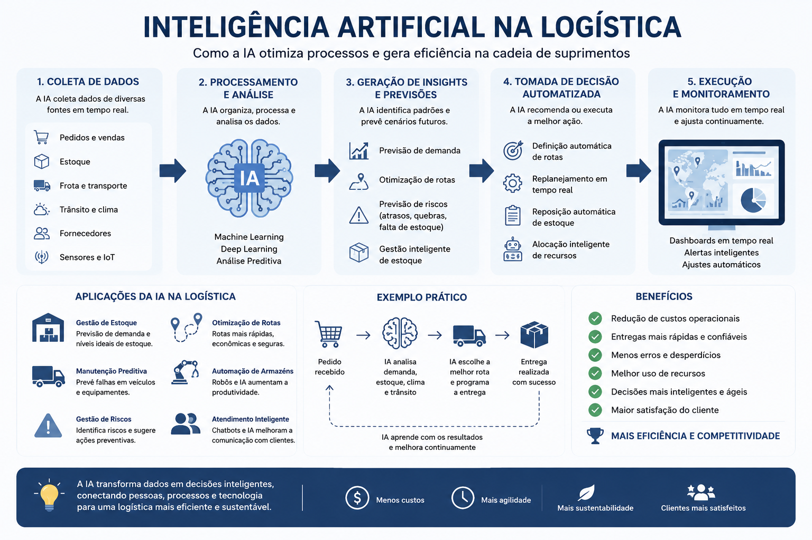

# Vivência Prática na GS1 Brasil

## Integrantes:
- Henry Motizuki
- Luiz Gustavo
- Pietro Henrique
- Matheus Lima
- Vinícius Hokamura

## Turma/Período:
- 3 DS

## Critério 1 - Contextualização e Precisão:
A GS1 é uma organização global responsável por desenvolver e manter padrões de identificação utilizados por empresas em todo o mundo. Seus padrões permitem que produtos, serviços e informações sejam identificados e rastreados de forma eficiente ao longo da cadeia de suprimentos. Conforme foi mostrado pelo palestrante Fernando, um dos padrões mais conhecidos da empresa é o código de barras, que é muito utilizado em supermercados, indústrias e centros de distribuição. Durante a visita ao Centro de Inovação e Tecnologia (CIT) da GS1 Brasil, foi possível conhecer as tecnologias criadas pela empresa que ajudam na automação, rastreabilidade e integração de dados, mostrando como as tecnologias da GS1 contribuem para a eficiência e segurança dos processos empresariais no mercado mundial.

## Critério 2 - Relação Teoria e Prática:

## Tecnologia 1:
# Código de Barras 2D / Digital Link:
O código de barras 2D consegue armazenar uma quantidade maior de informações do que os códigos tradicionais. Quando o código é escaneado por um leitor ou por um smartphone, os dados são capturados e enviados por meio da internet para um servidor. No Back-End, o sistema processa a solicitação feita pelo usuário e consulta no banco de dados as informações do produto, como lote, validade e distribuidora. Após esse processo todas as informações retornam para a tela do usuário, e tudo isso dependendo da velocidade da rede, pode levar menos de 1 segundo. Todo esse processo combina rede de computadores, banco de dados e programação Front/Back-End.

## Tecnologia 2:
# Sistemas de Inteligência Artificial para Logística:
Os sistemas de inteligência artifical usados para logísticas, utlizam grandes volumes de dados para otimizar processos como controle de estoque, roteiros de entregas e previsão de demanda. Os sensores, leitores e sistemas de gestão coletam informações de forma contínua e enviam elas para o servidores por meio da rede. No back-end, os algoritmos de inteligência artificial analisam os dados enviados, identificam padrões e geram previsões ou recomendações para auxiliar os usuários na tomada de decisão. Essa tecnologia demonstra a relação entre rede de computadores, back-end, inteligência artifical e banco de dados.

## Critério 3 - Reflexão Crítica:
Após a visita na GS1 Brasil, foi possível compreender como as tecnologias da GS1 fazem parte do nosso dia a dia. O maior exemplo é o código de barras, pois a maioria dos produtos que compramos no supermercado ou em outras lojas utilizam código de barras da GS1 Brasil. Não podemos esquecer do Digital Link, pois muitas empresas já estão adotando a tecnologia, muitos mercados já utilizam ele para dar informações mais detalhadas sobre os produtos para os clientes e ajudam os funcionários de supermercados a fazerem mudanças no preço ou informações do produto. Algumas farmácias já começaram a utilizar o Digital Link também, para rastrear medicamentos e facilitar o trabalho dos funcionários nas farmácias. Como mostrado na visita, indústrias, algumas farmácias e outros setores passaram a utilizar um braço robótico para localizar produtos e entregá-lo ao funcionário e tudo isso com a utilização do Digital Link que ajuda na parte da localização e envio de dados, e tudo isso citado acima utiliza rede de computadores, lógica de programação e banco de dados, exatamente o que estamos aprendendo no nosso curso. Com esse aprendizado, temos mais conhecimento sobre a área de TI o que pode nos ajudar em profissões futuras.
